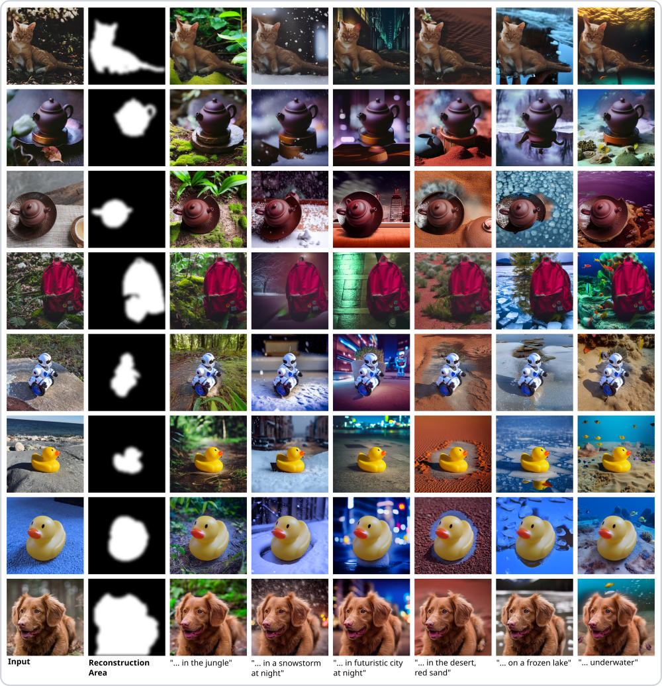
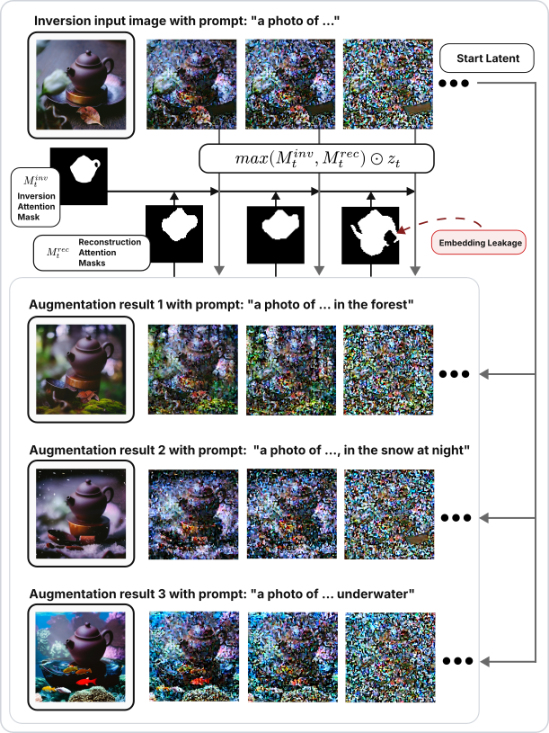
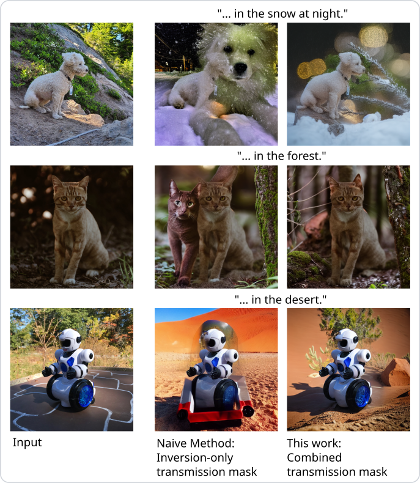
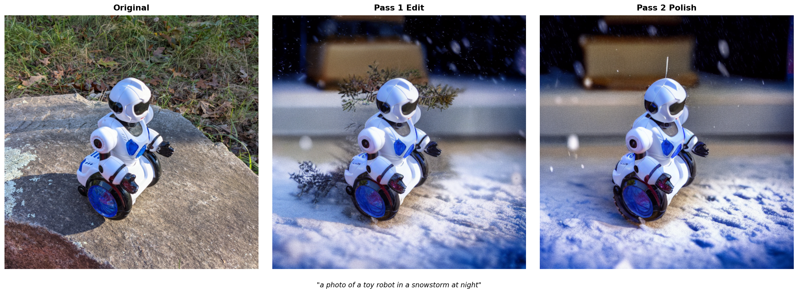

# Stable Diffusion Augmentation via Attention-Guided Latent Transmission

This repository implements a training-free, optimization-free attention-guided image editing pipeline built on Stable Diffusion 1.5. Given an image of an object and an edit prompt, it generates a new image where the background is replaced according to the prompt while the object itself is preserved.



*Each row: input image, SAM reconstruction mask, and six background edits across different prompts. Subjects are from the [google/dreambooth](https://github.com/google/dreambooth) dataset.*

---

## How it works

The method runs a two-pass DDIM inversion and reconstruction loop. In the first pass, cross-attention maps from the inversion are used to anchor the object to its original latent region, while reconstruction-time attention maps dynamically suppress concept leakage into the background. An optional second pass polishes the result with a shorter inversion from the first-pass output.



### Pass 1 — Attention-based latent transmission

**DDIM inversion and mask construction.**
DDIM inversion of the input image $x$ under an inversion prompt produces a latent trajectory $\{z^{\mathrm{inv}}_t\}$ and, at each timestep, a cross-attention map $A^{\mathrm{inv}}_t \in \mathbb{R}^{H_a \times W_a}$ for the target concept token. A base mask is computed by averaging attention over the first half of the inversion steps:

$$A^{\mathrm{base}} = \frac{1}{|\mathcal{S}_{\mathrm{base}}|} \sum_{t \in \mathcal{S}_{\mathrm{base}}} A^{\mathrm{inv}}_t$$

The inversion mask is then obtained by preprocessing, thresholding, and retaining only the largest connected component (LCC):

$$M^{\mathrm{inv}} = \text{LCC}\left(\text{Thresh}(\mathcal{P}(A^{\mathrm{base}}))\right)$$

Alternatively, the base mask can be sourced from a GroundingDINO + SAM segmentation instead of attention maps (`base_mask_source = sam` in config).

**Latent transmission at each denoising step.**
At reconstruction step $t$, the current latent $z_t$ is first blended with the inversion latent inside the protected region:

$$\tilde{z}_t = M^{\mathrm{inv}}_t \odot z^{\mathrm{inv}}_t + (1 - M^{\mathrm{inv}}_t) \odot z_t, \qquad M^{\mathrm{inv}}_t = \alpha_t \, M^{\mathrm{inv}}$$

where $\alpha_t \in [0,1]$ is a timestep-dependent decay factor (controlled by `transmission_alpha`, `transmission_alpha_end`, `alpha_decay_start`).

After denoising $\tilde{z}_t$ under the edit prompt to obtain $z^{\mathrm{rec}}_t$, a reconstruction attention map $A^{\mathrm{rec}}_t$ is computed and converted into a binary reconstruction mask:

$$M^{\mathrm{rec}}_t = \text{Dilate}\left(\text{LCC}\left(\text{Thresh}(\mathcal{P}(A^{\mathrm{rec}}_t))\right)\right)$$

The final per-step mask merges both sources:

$$M_t = \max\left(M^{\mathrm{inv}}_t, M^{\mathrm{rec}}_t\right)$$

The latent passed to the next step is:

$$z^{\mathrm{next}}_t = M_t \odot z^{\mathrm{inv}}_t + (1 - M_t) \odot z^{\mathrm{rec}}_t$$

The inversion attention anchors the concept to its original region; the reconstruction attention suppresses newly emerging off-target concept placements during denoising.

**Pass 2 — refinement (optional).**
A second DDIM inversion runs on the pass-1 output, but only partially (`invert_frac = 0.5`). The inversion prompt is empty and no reconstruction attention transmission is used, so the pass acts purely as a light refinement rather than an aggressive re-edit. The result is saved alongside the pass-1 intermediate.

---

## Motivation

A naïve approach to background editing with DDIM inversion transmits only the **inversion latents** inside the object mask — blending $z^{\mathrm{inv}}_t$ in the protected region at every denoising step. This suppresses unwanted edits to the object but introduces a failure mode: the edit prompt's **text embeddings still attend to the entire latent**, so the concept token can "leak" outside the protected region and cause the newly generated background to contain spurious copies or fragments of the subject.

The figure below compares the inversion-only baseline (middle column) against the combined mask used in this work (right column):



The fix is to additionally compute a **reconstruction attention mask** at each denoising step, which tracks where the edit-prompt concept is actively attending in the *reconstruction* pass. Dilating this mask and merging it with the inversion mask produces a per-step combined mask $M_t = \max(M^{\mathrm{inv}}_t, M^{\mathrm{rec}}_t)$ that suppresses leakage as it emerges, without requiring any additional training or optimization.

**Why a second pass?**
Pass 1 preserves the object's structure but the blending boundary can leave lighting and texture seams at the object edge. Pass 2 re-inverts the Pass 1 output with a short inversion (`invert_frac = 0.5`) and runs a light refinement denoising pass. Because the inversion starts from a near-clean latent and uses no reconstruction attention transmission, it acts purely as a polishing step — smoothing boundaries and harmonising illumination — rather than re-editing the scene. Note that Pass 2 is not always relevant: whether it improves the result depends on the concept, the edit prompt, and the random seed, and in some cases the Pass 1 output is the cleaner result.




---

## Setup

```bash
pip install -r requirements.txt
```

**Download the DreamBooth evaluation dataset** (optional, used for the default run):
```bash
bash download_dreambooth_dataset.sh
```

This clones only the `dataset/` folder from the [google/dreambooth](https://github.com/google/dreambooth) repository into `input_data/images_dreambooth/`.

---

## Usage

```bash
python main.py config.ini \
    --base-dir input_data/images_dreambooth \
    --output-dir output \
    --concepts input_data/concepts_dreambooth.txt \
    --prompts input_data/prompts.txt
```

Or use:
```bash
bash run.sh
```

Each run creates a numbered subdirectory under `--output-dir` (e.g. `output/001/`) and copies the config there for reproducibility.

**Concepts file** (`input_data/concepts_dreambooth.txt`): one concept per line, format:
```
name = description template | token1, token2
```
Example:
```
teapot = brown teapot | teapot
duck_toy = yellow rubber duck | duck
```

**Prompts file** (`input_data/prompts.txt`): one edit prompt per line, with `{}` as the concept placeholder:
```
photo of a {} in the jungle
photo of a {} deep underwater
```

---

## Configuration

All parameters live in `config.ini`. Key sections:

| Section | Key parameters |
|---|---|
| `[model]` | `name` (HF model ID), `device` |
| `[generation]` | `num_inference_steps`, `input_size`, `attention_res`, `allowed_places`, `base_mask_step_range`, `base_mask_source` (`attention` or `sam`) |
| `[pass1]` | inversion/guidance scales, transmission alphas, mask erosion/dilation radii, decay schedule |
| `[pass2]` | `enabled`, `invert_frac`, refinement prompt mode, transmission flags |
| `[sam]` | GroundingDINO and SAM model IDs, detection thresholds |

---

## Project structure

```
stable_diffusion_augmentation/
├── main.py                        # Entry point
├── edit.ipynb                     # Interactive notebook interface
├── config.ini                     # Default configuration
├── run.sh                         # Convenience run script
├── requirements.txt
├── download_dreambooth_dataset.sh # Helper for downloading the DreamBooth dataset
├── input_data/
│   ├── concepts_dreambooth.txt    # Concept definitions
│   ├── prompts.txt                # Edit prompts
│   └── images_dreambooth/         # Input images (one folder per concept)
├── output/                        # Numbered run directories
└── sd_editing/
    ├── pipeline.py                # SD 1.5 pipeline setup
    ├── inversion.py               # DDIM inversion
    ├── editing.py                 # Latent transmission loop
    ├── attention.py               # Attention map extraction
    ├── masks.py                   # Mask construction utilities
    ├── batch.py                   # Batch processing over concepts and prompts
    └── sam_mask.py                # GroundingDINO and SAM segmentation
```
